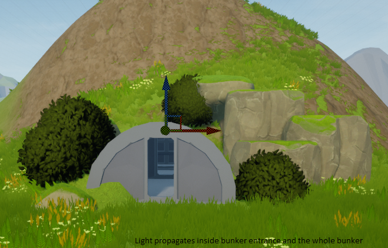
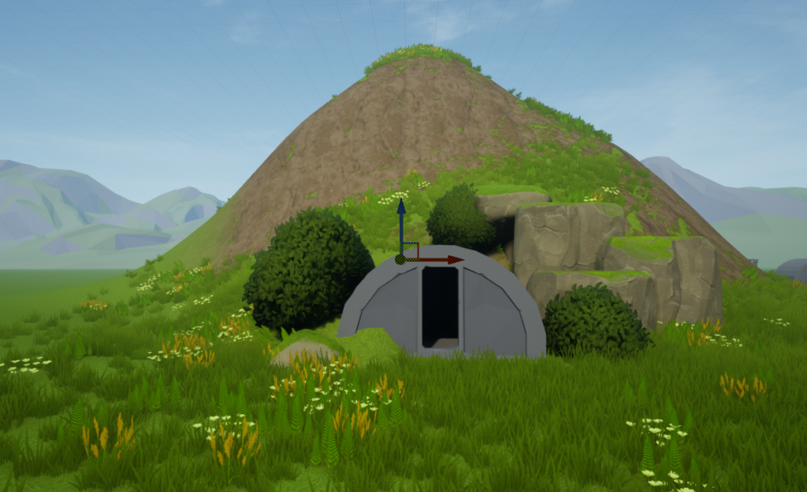
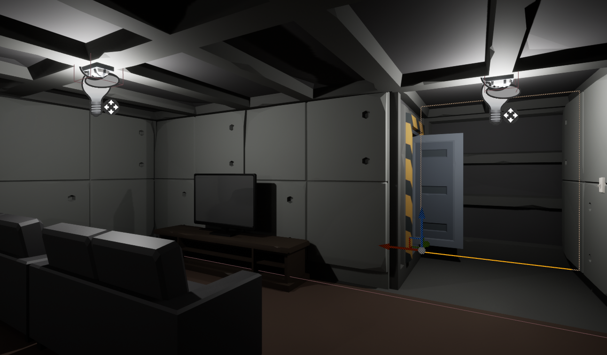
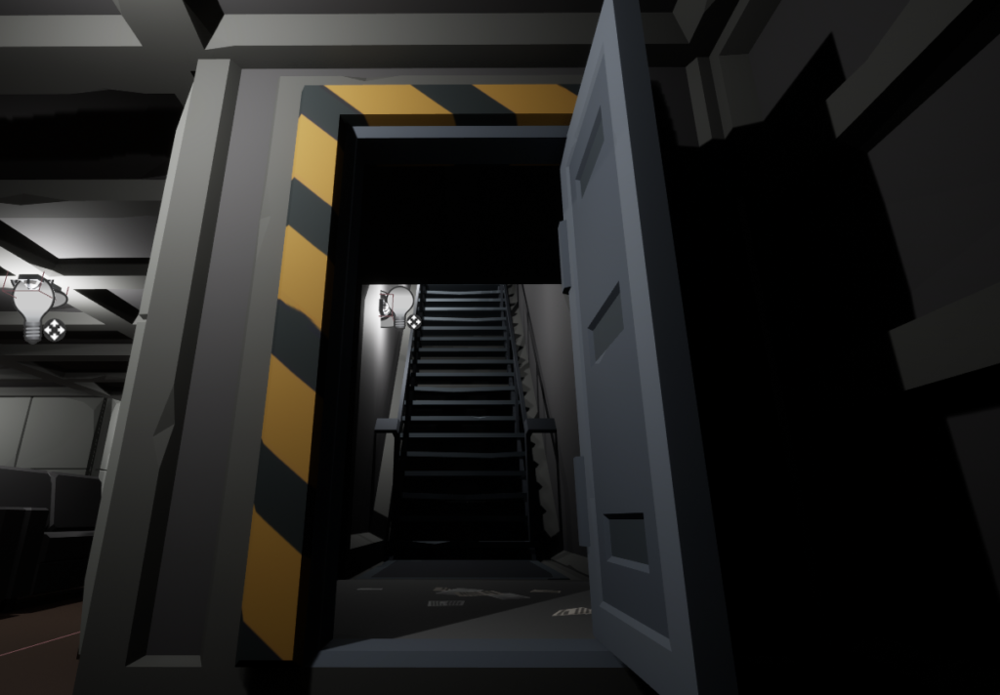
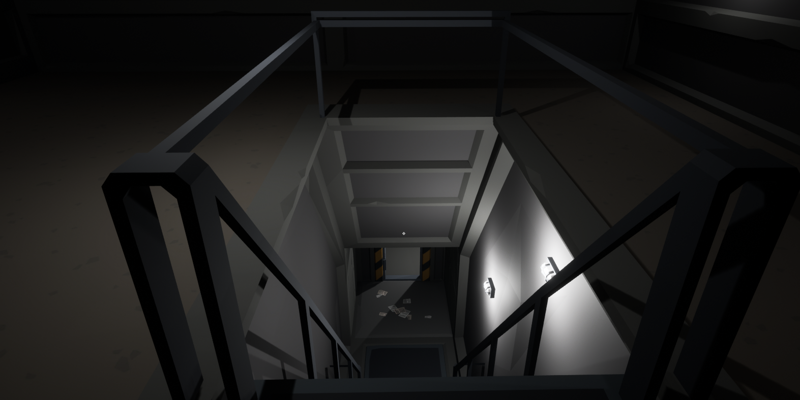
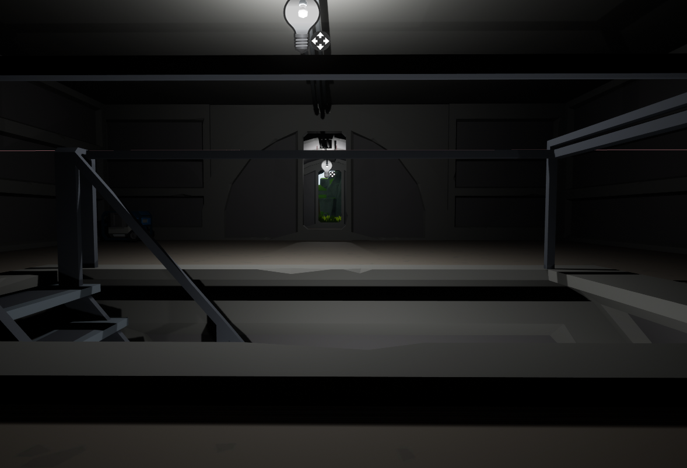
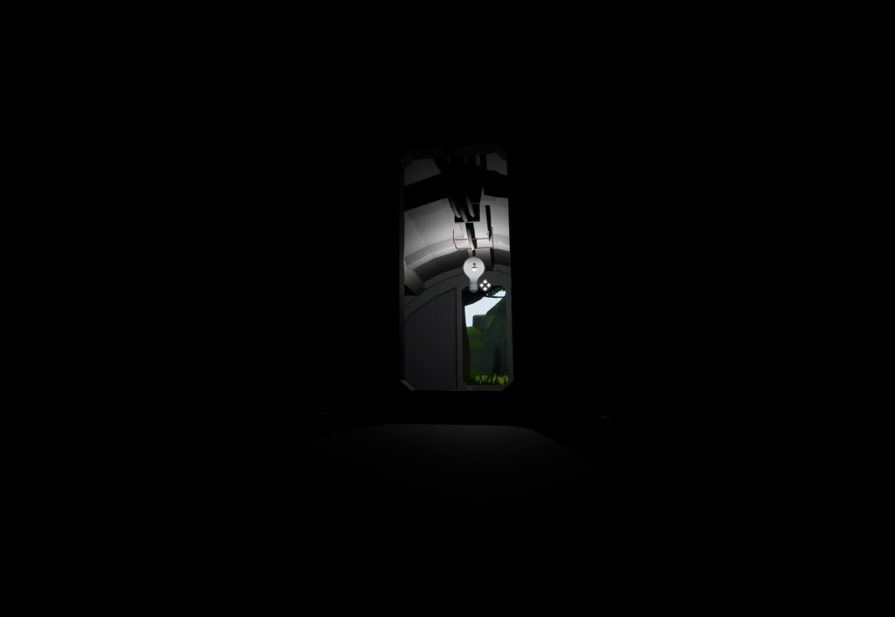
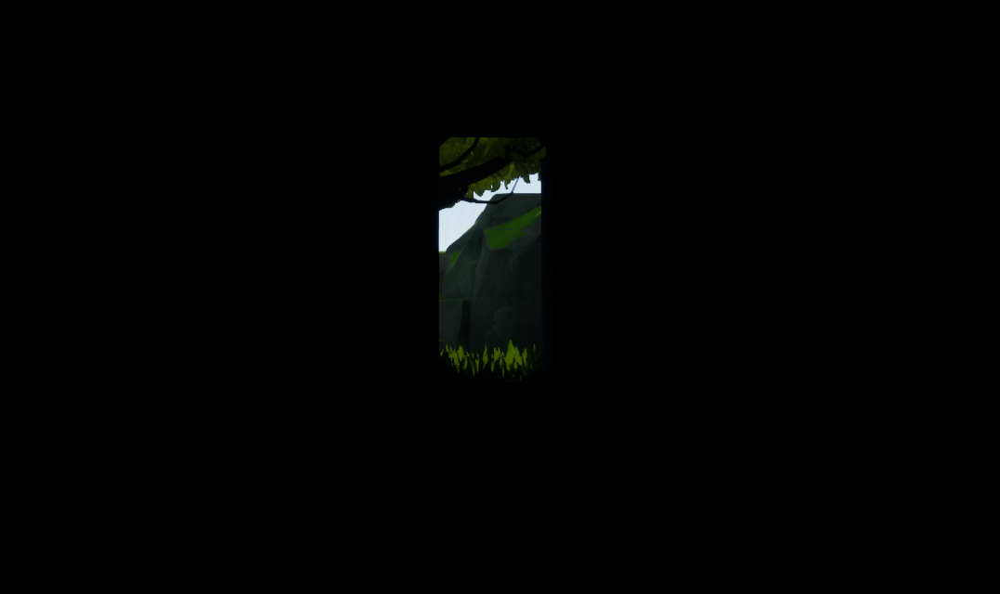
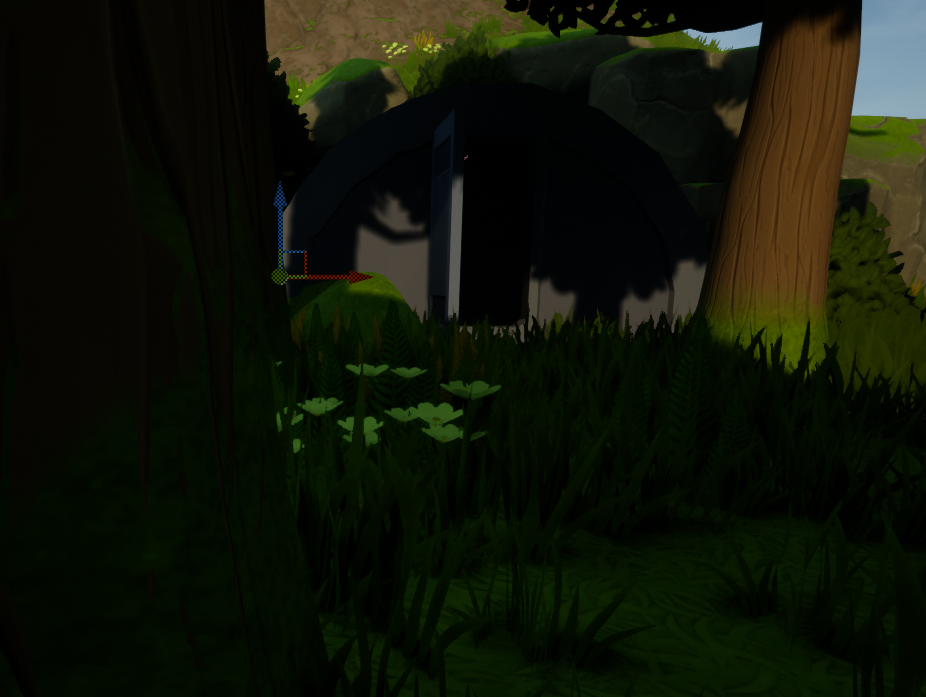
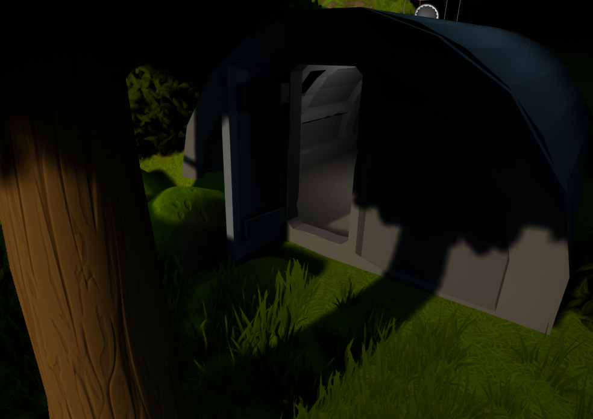

Hi, this is the first post here on the devblog, my name is Kelvin S. Rosa ('frost), I'm the developer behind Lightshaft games, in this blog i will talk about the game I've spent years prototyping, stopping, rethinking, and starting over. The focus of the devblog is to show the progress of the game, the technologies applied, maybe some tutorials…
<!-- truncate -->

Seeds of Nature has been in development in my head for over 8 years, it's a complex game with survival mechanics, simulation, farm and much more. Based on the final objective of the game the process is quite complicated for a one man army, my main focus the area I master is programming, I'm not good with drawings, I even know how to model in 3D, animate, do level design, but to speed up the development of the game and finish a demo to show the main idea of the game, I buy ready-made 3D models that would fit with the result I want, my game is called Seeds of Nature, acronym SON.

I would like to have someone on board who could handle the 3D part, but my budget for hiring someone is $0, 100% of the money invested in the game currently has been taken from my funds. Put this project on <a href="https://www.patreon.com/lightshaft">Patreon</a>   to try to get some funds to speedup the creating process, getting someone to the team. In this blog I will talk about the development process, create some tutorials and maybe post some of my pets of unusual species that will be present in the game, let's get to it, in this first post I will talk about the lighting process of the game.
## O Bunker

Currently the game has many mechanics ready, I will talk about some of them in future posts, lighting was something I wasn't even paying attention to until I remodeled the game's story and realized that it would be essential. As with any good survival and farming game having a day and night cycle is essential, now imagine if you need dark environments in your game like an underground bunker!

The initial part of the game will be focused on a bunker, it will be the place where you will start your journey, I can't say much about the narrative yet, but your adventure/life will start inside a bunker that is running out of basic resources, supplements, you've been locked inside for 3 years, you don't know what happened to the surface in those years that have passed. The power system is starting to fail, you only have 2 weeks of guaranteed food. There is no other option but to go to the surface.

The bunker is equipped with various survivalist equipment, books, recipes, in other words, you have a brief preparation to survive out there if necessary.

As it is a bunker I wanted to make it a place that does not receive external light, as the game has a dynamic lighting system, day and night cycle, seasons, different climates, I needed to use a skylight (light emitted by the sky or material sky), this makes the entire game world lit up including underground parts this made the bunker lit up inside, it's not the result I expected. Leaving only a directional light works as the lighting is not global, but the outside environment is very dark, and the weather is unrealistic.

||
|:--:| 
|*Inside it is possible to see a constant light, coming from the skylight, even with the correct shadows..*|

This made me rethink the lighting in my game, I tried using Distance Fields and Ambient Occlusion, did it work? Nahh, not how I would like, I had to Bake, and several strange spots appeared inside the bunker, they had to do with the distance mesh size of each object. I decided to study a little more, reset the value of SkyLight, adjusted the directional lights of the sun and moon. It worked out? Yea! it worked, but I noticed that the whole external environment was kind of lifeless, with weak colors, I needed the skylight. A few hours later I realized that I was using Unreal Engine 5 and that it had a new lighting technology called Lumen. I read the documentation, watched some tutorials, and it was time to test it, Project Settings>Rendering>Global Illumination: Lumen. Restart UE5, and presto, there was my bunker, all dark, no interior light!! It was the result I expected.

Now I can create interiors, caves, more bunkers, all using real behaving light. Nowadays there are video cards with raytracing costing the eye of the face, which use raytracing based on hardware, Lumen is nothing more than a raytracing via software. The performance was affected a little, but very little, which in the final version of Unreal Engine 5 will probably have improved a lot. In short, “Lumen” is amazing!

First test with the bunker prototype and Lumen:

||
|:--:| 
|*Here we have a more real lighting, the only light entering the bunker is the one coming through the door, coming from the sun.*|

With a few tweaks to the interior, we have good interior lighting!
I noticed that the more light I put, the heavier the calculation and the frames decrease, but just set the lights to not affect the calculation of the environment. But anyway I chose to use few lights, because all game systems will be dynamic, each light can be set to a switch, and can be dynamically created by players. But that's for another post where I'll explain the game's electrical power system.

||
|:--:| 
|*Inside the Bunker (WIP) - Underground entrance room with internal lights on.*|

|| 
|:--:| 
|*Bunker Inside (WIP) - Staircase from the basement to the inside of the surface, with the lights on.*|

||
|:--:| 
|*Bunker Inside (WIP) - Surface level with lights on.*|

||
|:--:| 
|*Inside Bunker (WIP) - Inside the bunker on the Surface, with a view of the stairs to the basement and entrance to the bunker with an outside view, inside light on.*|

||
|:--:| 
|*Bunker Inner Part (WIP) - Inner part of the surface, looking out, and light only in the first room.*|

||
|:--:| 
|*Inside the Bunker (WIP) - View from the first room out of the bunker with the lights off, here you can see that the ambient light goes on normally outside.*|

||
|:--:| 
|*Outside of the Bunker (WIP) - You can see in the middle of the shadows the door of the bunker, and all the darkness inside because the lights are off.*|

||
|:--:| 
|*Bunker Exterior (WIP) - Now with the interior lights on, you can see that the light behaves in a real way, both the interior shadows are lighter and you can also see the shadow and the external light passing through the door on the side inside the bunker.*|

## Activating Lumen on your project

To use Lumen as default global ilumination, just navigate to **Project Setting**, then **Rendering**, then **Global Illumination** in **Dynamic Global Ilumination Method**, select **Lumen**, the editor will ask to activate **Generate Mesh Distance Fields** if it is not activated, then restart the Engine, Lumen Ilumination will be activated and enabled on your map.
It is possible to controll the quality using Post Process Volumes, I will talk more about it in a post about Lumen Only.

## Terrain/Landscape Hole.

In Seeds of Nature the game base/ground is based on a landscape, as the game will be open world the main focus is have zero loading, 
Em Seeds Of Nature a base do jogo é composta por um ladscape/terreno, como o jogo será de mundo aberto, o foco é ter zero loading, in order for the bunker to be part of the environment and actually be underground, it was necessary to apply an Unreal feature called Landscape Visibility. I will make a post and a tutorial about it later. This functionality consists of creating a layer on the terrain material that is responsible for the visibility of the terrain, where this mask is applied nothing in the terrain material is rendered and all collision properties are removed, being able to actually traverse the terrain, it is a interesting technique for making caves, holes in the ground, etc.

So that's it, this is my first post, I hope to improve the way I present it from now on. Feel free to comment below, suggestions are welcome, follow me on social media, links in the card below.
