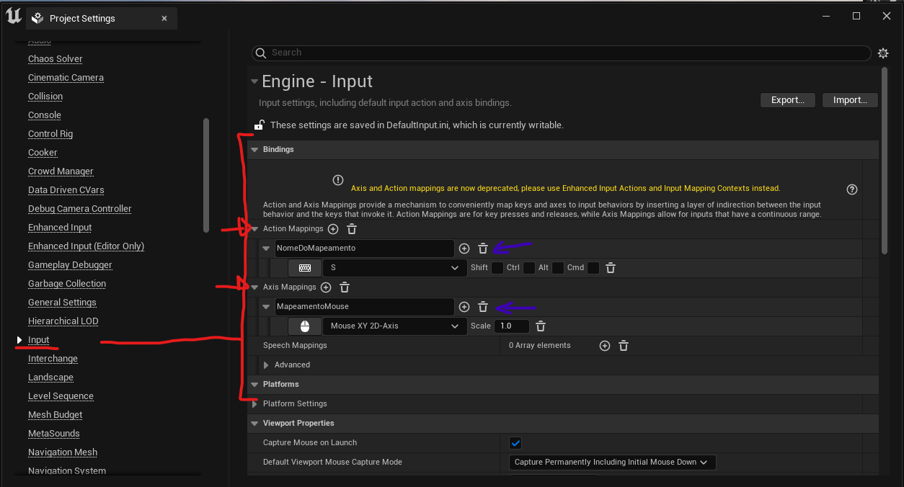
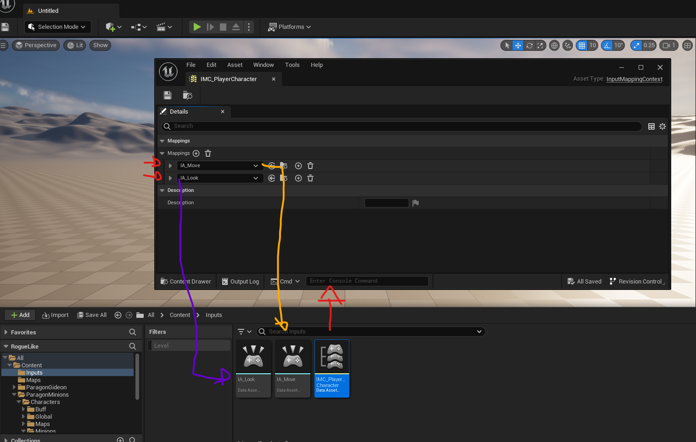
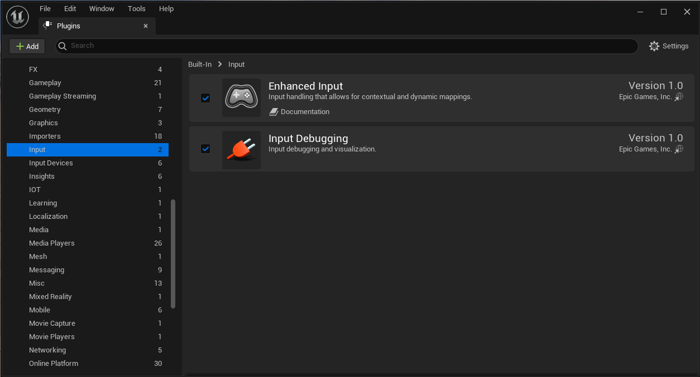
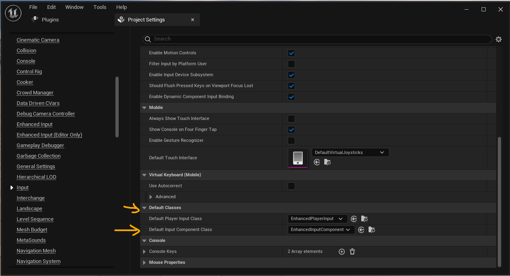
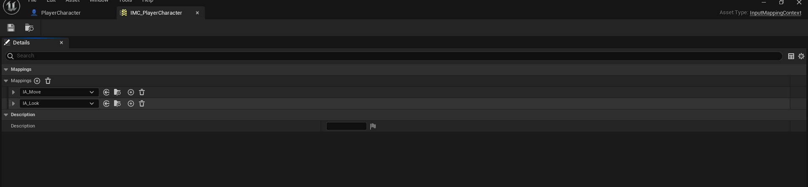
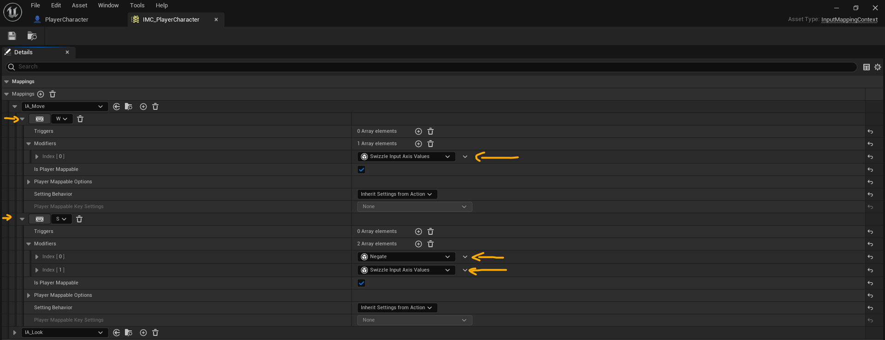
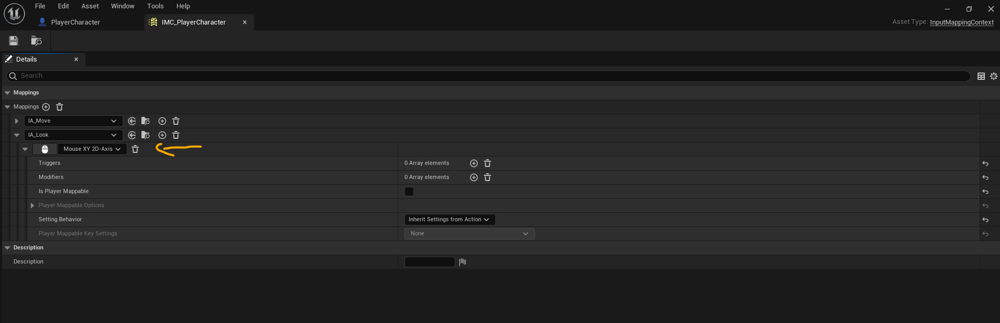

Olá, a muito tempo não escrevo nada aqui. Desta vez é sem enrolação vou direto ao assunto; Recentemente (não tão recente assim) a **Unreal Engine** colocou o antigo Input System em Obsoleto. Por padrão nas novas versões da Engine  o novo Input System já vem habilitado.
<!-- truncate -->

# Qual a diferença?

O antigo input system era definido no **Project Settings** da Engine , era necessário criar os Action Mappings e os Axis Mappings na aba Input e chamar a ação dentro do Blueprint, já no novo sistema é tudo mais dinâmico cada ação é definida em um arquivo do tipo **Input Action** e setado em um arquivo do tipo **Input Mapping Context**, este serve como uma coleção de Input Action, podendo conter varios tipos de ações diferentes e ser setado de forma dinâmica de acordo com a necessidade.

## Exemplos

**Input System Antigo**:


**Input System Novo**:


## Implementando em C++

Por padrão a Unreal ainda não cria a classe Character com os novos inputs, abaixo irei ensinar como criar a base do seu Character usando o Enhanced Input System:

**Primeiro verifique se o Plugin está habilitado**


Caso prefira habilitar o plugin pela sua IDE adicione as seguintes linhas no seu ***.uproject**


```csharp
"Plugins": [
	{
		"Name": "EnhancedInput",
		"Enabled": true
	},
]
```

**Habilitando o EnhancedPlayerInput**
Na Engine vá para **Edit>Project Settings>Input** e em Default Classes defina 
**EnhancedPlayerInput** no *Default Player Input Class* e **EnhancedInputComponent** em *Default Input Component Class*



Agora na sua IDE abra o arquivo 
***.Build.cs** e adicione "EnhancedInput" dentro de **PublicDependencyModuleNames**:
```csharp
PublicDependencyModuleNames.AddRange(new string[]
	{
		"Core",
		"CoreUObject",
		"Engine",
		"InputCore",
		"EnhancedInput"
	});
```

Vamos para o código, o Input precisa ser adicionado no seu personagem, caso já tenha um script de personagem apenas edite, caso contrário crie um novo script usando a classe **ACharacter** como herança, depois adicione a seguinte linha de código no .h do seu personagem para definirmos no editor depois.
``` cpp
protected:
	UPROPERTY(EditDefaultsOnly, BlueprintReadOnly, Category = "Enhanced Input")  
	class UInputMappingContext* InputMapping;
```

Por padrão todos os personagem **ACharacter** possuem uma função chamada **SetupPlayerInputComponent**, precisamos adicionar o novo input no player, para isso remova todo o código que já estiver dentro dessa função no .cpp do personagem e substituia pelo seguinte código:
``` cpp
void ASCharacter::SetupPlayerInputComponent(UInputComponent* PlayerInputComponent)  
{  
Super::SetupPlayerInputComponent(PlayerInputComponent);  
// Get the player controller  
APlayerController* PC = Cast<APlayerController>(GetController());  
  
// Get the local player subsystem  
UEnhancedInputLocalPlayerSubsystem* Subsystem = ULocalPlayer::GetSubsystem<UEnhancedInputLocalPlayerSubsystem>(PC->GetLocalPlayer());  
// Clear out existing mapping, and add our mapping  
Subsystem->ClearAllMappings();  
Subsystem->AddMappingContext(InputMapping, 0);  
  
// Get the EnhancedInputComponent  
UEnhancedInputComponent* PEI = Cast<UEnhancedInputComponent>(PlayerInputComponent);  
  
}
```

Adicione também esses headers:
``` cpp
#include "InputMappingContext.h"
#include "EnhancedInputSubsystems.h"
#include "EnhancedInput/Public/EnhancedInputComponent.h"
```
Compile para ver se tudo ocorreu bem.

Novamente no .h do seu personagem adicione uma referencia a classe **UInputAction** no topo para não precisar adicionar os .h da classe, logo abaixo os includes
``` cpp
void ASCharacter::SetupPlayerInputComponent(UInputComponent* PlayerInputComponent)  
{  
Super::SetupPlayerInputComponent(PlayerInputComponent);  
// Get the player controller  
APlayerController* PC = Cast<APlayerController>(GetController());  
  
// Get the local player subsystem  
UEnhancedInputLocalPlayerSubsystem* Subsystem = ULocalPlayer::GetSubsystem<UEnhancedInputLocalPlayerSubsystem>(PC->GetLocalPlayer());  
// Clear out existing mapping, and add our mapping  
Subsystem->ClearAllMappings();  
Subsystem->AddMappingContext(InputMapping, 0);  
  
// Get the EnhancedInputComponent  
UEnhancedInputComponent* PEI = Cast<UEnhancedInputComponent>(PlayerInputComponent);  
  
}
```

``` cpp
class UInputAction;
```
Na parte publica defina os Inputs que deseja usar, exemplo:
``` cpp
UPROPERTY(EditDefaultsOnly, BlueprintReadOnly, Category = "Enhanced Input")  
UInputAction* InputMove;  
  
UPROPERTY(EditDefaultsOnly, BlueprintReadOnly, Category = "Enhanced Input")  
UInputAction* InputLook;
```
Ainda no .h crie as funções que serão chamadas quando ocorrer a ação:
``` cpp
void Move(const FInputActionValue& Value);  
  
void Look(const FInputActionValue& Value);
```
Agora no .cpp crie a chamada das funções:
``` cpp
void ASCharacter::Move(const FInputActionValue& Value)  
{  
	const FVector2D MoveValue = Value.Get<FVector2D>();  
	if (MoveValue.Y != 0.f)  
	{  
		AddMovementInput(GetActorForwardVector(), MoveValue.Y);  
	}  
}  
  
void ASCharacter::Look(const FInputActionValue& Value)  
{  
	const FVector2D LookValue = Value.Get<FVector2D>();  
  
	if (LookValue.X != 0.f)  
	{  
		AddControllerYawInput(LookValue.X);  
	}  
  
	if (LookValue.Y != 0.f)  
	{  
		AddControllerPitchInput(LookValue.Y);  
	}  
}
```
No exemplo acima criei duas funções, uma para se mover e outra para olhar para os lados.
No .cpp do seu personagem na função **SetupPlayerInputComponent** adicione essas linhas de código:
``` cpp
PEI->BindAction(InputMove, ETriggerEvent::Triggered, this, &ASCharacter::Move);  
PEI->BindAction(InputLook, ETriggerEvent::Triggered, this, &ASCharacter::Look);
```
A função vai ficar assim:
``` cpp
void ASCharacter::SetupPlayerInputComponent(UInputComponent* PlayerInputComponent)  
{  
Super::SetupPlayerInputComponent(PlayerInputComponent);  
// Get the player controller  
APlayerController* PC = Cast<APlayerController>(GetController());  
  
// Get the local player subsystem  
UEnhancedInputLocalPlayerSubsystem* Subsystem = ULocalPlayer::GetSubsystem<UEnhancedInputLocalPlayerSubsystem>(PC->GetLocalPlayer());  
// Clear out existing mapping, and add our mapping  
Subsystem->ClearAllMappings();  
Subsystem->AddMappingContext(InputMapping, 0);  
  
// Get the EnhancedInputComponent  
UEnhancedInputComponent* PEI = Cast<UEnhancedInputComponent>(PlayerInputComponent);  
  
PEI->BindAction(InputMove, ETriggerEvent::Triggered, this, &ASCharacter::Move);  
PEI->BindAction(InputLook, ETriggerEvent::Triggered, this, &ASCharacter::Look);  
  
}
```
Essas 2 novas linhas pegam o **EnhancedInputComponent** e registra a função a ser chamada quando ocorrer a ação. Com isso nossa base no c++ está pronta.

**Compile o projeto e tenha certeza que não deu nenhum erro.**

Agora é necessário criar um pesonagem baseado na nova classe que criamos(ou editamos).
No Blueprint do seu personagem será necessário setar 3 campos (de acordo com o exemplo acima, usando 2 Input Actions). 
Para isso precisamos criar o **Input Mapping Context** , clique com o botão direito  em alguma de suas pastas no projeto e navegue até Input>Input Mapping Context , nomeie com o nome que achar melhor, e em seguida crie 2 arquivos do tipo **Input Action** (clique direito Input>Input Action), defina o nome que desejar no meu caso usei IA_Look e IA_Move. Abra o arquivo do tipo Input Mapping Context que você criou, e adicione os 2 Input Action que você criou.



No meu caso criei um Input para se mover e outro para olhar, o Enhanced Input System tem muitas funcionalidades interessantes, um exemplo é que é possível criar combos, mas isso fica para um post futuro, vou mostrar como adicionar um movimento básico.

No IA_Move adicionei duas ações, ao apertar W e ao apertar S, é necessário adicionar modificadores, no W apenas adicionei o modificador de movimentação no eixo, já no S antes da movimentação adicionei um **Negate** que serve para o contrário da ação seguinte.


Ja no IA_Look apenas adicionei um **Mouse XY 2D-Axis**, que serve para capturar a posição do mouse.


Agora abra o Blueprint do seu personagem e em Details procure por Enhanced Input e adicione o arquivo Input Mapping Context e os Input Action que você criou.
Feito isso só rodar a cena. Você pode adicionar quantas ações desejar e customizar a funcionalidade. Em Blueprint é muito mais simples. Basta definir como variável um InputAction e chamar o evento no Blueprint.

Source code aqui https://gist.github.com/kelvinRosa/6395e71474fda729ff30f2d8f46aad58 :
<script src="https://gist.github.com/kelvinRosa/6395e71474fda729ff30f2d8f46aad58.js"></script>
