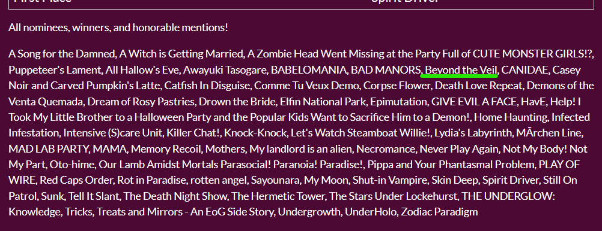

Da alegria ao desespero, minha primeira jam foi igual à minha juventude... uma aventura maluca e, no fim, tive que me virar. Acompanhe essa saga insana.

<iframe frameborder="0" src="https://itch.io/embed/3001878" width="552" height="167"><a href="https://befinamor.itch.io/beyond-the-veil">Beyond the Veil by Triz, Frost</a></iframe>

<!-- truncate -->
Spooktober Jam 2024. Estava eu numa fase empolgada, querendo participar de uma jam até o fim (já participei de outras, mas sempre sozinho, e acabava ficando sem tempo, não terminava o projeto e nem chegava a submeter minha participação). Graças à minha amiga Be, tive força de vontade suficiente pra me arriscar nessa jam. Combinei com a Be que eu seria o dev e a gente ia entrar junto pra procurar outros parceiros pra nossa equipe. Alguns dias antes da jam começar, fui atrás de mais pessoas pra compor o time. Precisávamos de um artista e alguém bom com som. Em poucos dias, encontrei ambos: a artista, uma chinesa-canadense com experiência em fanzines e que queria muito ter um projeto de jogo, e o músico, um francês que já tinha feito sons para curtas e alguns jogos.

Tínhamos formado um dream team. Eu estava muito empolgado, e acredito que a Be também. Ah, não expliquei — a Be é game designer e minha amiga. Adoro as ideias dela e o quanto ela escreve bem. Queria escrever metade do que ela escreve, já que gosto de escrever, mas acabo não ligando tanto pra forma... só escrevo e coloco pra fora do jeito que me sinto à vontade. Enfim, ela estava focada e teve uma ideia muito legal. O tema da jam era terror, e precisava ser uma visual novel. Eu nunca tinha feito uma visual novel antes. Estudei um pouco antes de escolher a tecnologia. Sou especializado na Unity Engine, mas estava de olho em outras opções. Conheci o incrível Ren'Py, uma engine open source para visual novels. Ela me serviu de inspiração pra algumas coisas no nosso jogo.

Com a ideia do primeiro capítulo pronta pela Be, criei um grupo no Discord e juntei todo mundo. Tinha a barreira da linguagem, mas todos falavam inglês, então foi fácil se comunicar (por texto). Tanto a artista quanto o músico adoraram a ideia e pareciam super empolgados. Mas não podíamos começar antes da data estipulada. Debatemos um pouco sobre nossas referências de horror e inspirações. Decidimos usar a cultura chinesa misturada com a brasileira nos personagens.

Dia de início! Assim que começou a jam, já fui conversar com o músico pra definirmos quais tecnologias usar. Ele sugeriu usarmos FMOD para o áudio. Nunca tinha usado, mas aprendi em um dia. Já comecei a fazer o setup de tudo na Unity. Comprei o plugin Naninovel, que facilitava a escrita do roteiro dentro do game, e já tinha muita coisa pronta. Mas tive que alterar e acrescentar muita coisa na engine por causa do FMOD e das interações que criamos. Nos primeiros dias comecei a prototipar tudo. Em alguns dias, a artista mandou os concepts coloridos de duas personagens da nossa história. Ficamos encantados com a arte e com o que poderia ser nosso jogo final. Doce ilusão, haha. Escrever isso me traz de volta o ódio que senti no fim de tudo.

Tínhamos 30 dias pra terminar o jogo. Passou uma semana e a artista só tinha mostrado os concepts das duas personagens, dizendo que estava trabalhando em outras poses. Eu fiz o primeiro capítulo do jogo com todos os diálogos e mecânicas. Tínhamos um sistema de celular, e precisei integrar o FMOD com o Naninovel — o que deu um trabalho enorme, já que o sistema do Naninovel usava AudioSource da Unity. Eu também queria sons enquanto as falas dos personagens apareciam, tipo aqueles efeitos de som quando está aparecendo o texto na tela, e queria que cada personagem tivesse uma variação diferente. Isso foi muito complicado de criar usando FMOD, mas consegui.

Minha preocupação maior passou a ser a demora da arte. Pela minha experiência, trabalhar com placeholders e depois fazer a troca sempre dá problemas não previstos e acaba demorando mais do que o planejado. E a gente não tinha nada de background, nem ideia de como ficariam as poses. No fim, o posicionamento e outras questões estéticas do jogo acabaram sendo definidas por mim e pela Be — não pela artista. Ela parou de perguntar sobre o jogo e não dava feedback das artes. Eu, como um cara quieto e bonzinho que não gosta de incomodar, fiquei sem falar nada na primeira semana. Na segunda semana, já me preocupei e comecei a cobrar. Ela dizia que no fim de semana teria tudo da personagem principal, e decidiu chamar uma amiga artista pra ajudar e fazer os backgrounds. A Be enviou as referências que queria, e a amiga disse que faria. Eis que surge minha segunda decepção.

O músico. Ele havia feito algumas criações de áudio no FMOD, subiu os arquivos e disse que era tudo o que ele tinha pensado para o primeiro capítulo. Eu abri os áudios e... meu amigo... não entendi nada. Nada fazia sentido. Alguns sons estavam superficiais, outros não combinavam. As fontes vinham de uma biblioteca paga. Fiquei preocupado com a falta de sons para várias coisas e fui eu mesmo caçar em sites de SFX gratuitos. Montei várias variações no FMOD, aprendi a criar sons 3D, fazer composições, criar parâmetros... Foi uma loucura. Uma grande XP pro meu currículo/portfólio. Porém, eu estava trabalhando bem mais do que deveria — além da minha função no projeto.

Comecei a me preocupar que a arte talvez não ficasse pronta. Já haviam se passado 2 semanas e a gente praticamente não tinha nada. A Be havia escrito mais uma parte da história e também começou a demonstrar preocupação. Continuei cobrando a artista, e ela fazendo promessas pro fim de semana... de novo. Na terceira semana, já sabia que não ia rolar. Conversei com a Be e decidimos pedir só os concepts, nada de arte final. Disse que podiam ser rabiscos, só pra termos algo visual. A artista se empolgou e disse que podíamos fazer o jogo em preto e branco(que é o que a gente ia fazer por isso pedi somente os rabiscos). Falou com a amiga. Durante a semana, a amiga mandou 2 backgrounds desenhados à mão e ela mandou as duas garotas em preto e branco.

Voltei a ter esperança. Segui para o capítulo 2, comecei a criar mecânicas, passar os textos para o Naninovel e fazer os sons. O músico sumiu. Comecei a cobrar os backgrounds e personagens e... nada. A Be já estava desanimando. Ela reduziu a ideia base do jogo, e eu, com o objetivo de lançar a submissão a todo custo, comecei a fazer coisas em 3D e tirar prints pra usar de cenário e background. Criei filtros preto-e-branco pra bater com os personagens. Continuei cobrando, e a artista só me dava prazos e não entregava.

Faltando 1 semana para o fim, estávamos com muitos personagens e variações faltando. De backgrounds, só tínhamos 3 — e eram vários no que ja havia sido escrito. Procurei alternativas. Usei o VRoid Studio pra criar personagens e salvar .png com poses. Deu muito trabalho e ficaram horríveis, mas eu ia lançar assim. A Be ia odiar, mas eu não ia desperdiçar meu suor e esforço.

Na última semana, a Be ficou até tarde comigo alinhando coisas e tentando finalizar o jogo. Ela me ajudou em tudo. Faltando 3 dias, encontrei um artista oferecendo ajuda. Perguntei se ele queria fazer uns backgrounds pra gente. Ele topou. Mandei prints de todos os backgrounds 3D e falei que ele podia desenhar por cima ou fazer do jeito dele. Em 1 dia, ele enviou praticamente todos. E aí eu pensava: por que diabos a outra pessoa demorou tanto tempo pra não enviar nada, mesmo quando a gente só pediu concept?

A arte final da personagem era incrível. Mas naquele estágio, a gente só queria os concepts pra conseguir participar.

Faltando 1 dia, a Be foi criar a página da submissão e pediu os e-mails pra colocar nos créditos. E aí... o espanto geral: todo mundo resolveu aparecer. O músico, a artista, a amiga... todo mundo. A artista parecia espantada. Senti no ar um: “Como assim... eles fizeram o jogo? Mas eu nem enviei as artes...”. Ela se ofereceu pra ajudar com a página, do nada. Rapidinho fez variações dos personagens, fez os que faltavam... em um dia.

E pra quem sobra o trabalho e a necessidade de rushar? Pra mim, claro. Como falei, trocar placeholders sempre dá problema. E lá fui eu adaptar os personagens. A amiga dela mandou mais backgrounds só do primeiro capitulo, mas descartei todos e usei os do salvador que apareceu na última semana. E o cara nem pediu crédito — mas colocamos lá.

Muito puto da vida, troquei os personagens, adaptei tudo, pedi uma alteração, ela fez — tudo no último dia. Se ela tivesse participado assim por uma semana, teríamos feito o jogo pefeito para a jam. Fiz milagre com os sons, corri com animações customizadas, mesmo nada disso sendo meu forte. Fiz até uma mecânica de desenhar um símbolo chinês com o mouse, como se fosse com sangue da personagem em um espelho. Alguns assets eu editei no Blender... entre outras loucuras.

No dia do envio, corri pra gerar a build e ajustar coisas com a Be. Cortamos partes, finalizei.

Enviei no grupo para testarem e, pela primeira vez, a artista jogou. Eu já tinha enviado builds anteriores sem arte, só com diálogos, e ela nem tinha visto. Quando terminou de jogar, começou a elogiar bastante a mim e à Be. O músico ficou chateado porque percebia que só usei a música introdutória dele — porque, sinceramente, o resto não dava pra usar. Ainda tentei fazer variações com os áudios dele pra não descartar tudo.

Eu estava furioso com eles aparecendo como se nada tivesse acontecido — mas fingi estar tudo bem. Até que...

...A artista do nada começou a surtar quando submetemos o projeto, ela do nada queria ser co-autora e disse que era pra ELA fazer o envio, e que ELA queria ter criado a página. A Be, que ficou responsável por todo o texto da página, organização e submissão, ficou sem entender muito bem a atitude da artista. Eu estava no meio tentando não explodir. A artista começou a ficar pressionando pra deixarmos ela como co-autora, e eu estava com sangue nos olhos porque NÓS (eu e a Be) tínhamos feito o jogo praticamente inteiro, enquanto a artista sumiu por 3 semanas e apareceu só no final, com artes boas, sim, mas tarde demais.

Fiquei indignado com a forma como ela tratou a Be, pois a culpa no geral de ela ter surtado foi minha, de quem apontou e quem não queria que ela tomasse mais que o crédito que era devido a ela. A Be apenas queria que o projeto fosse enviado, e eu também. No fim, a artista continuou atacando a gente no Discord, e eu só disse que a submissão foi feita por quem realmente estava comprometido com o projeto desde o início e a quem era devido o crédito de autor.

Depois disso, o grupo basicamente morreu. O músico desapareceu de novo, a amiga da artista nunca mais falou nada, e a artista ficou causando no discord, minha DM estava pura zona de guerra. Eu e a Be seguimos em frente, frustrados mas orgulhosos, mesmo com tantas adversidades. Foi uma loucura... mas conseguimos.

Ficamos mal por vários dias. Era como se todo o esforço tivesse sido manchado por aquele desentendimento final. Saber que o jogo foi reconhecido e elogiado só aumentou a sensação de frustração — porque poderíamos ter comemorado juntos, mas em vez disso, fomos empurrados para o silêncio.

Link do jogo:

<iframe frameborder="0" src="https://itch.io/embed/3001878" width="552" height="167"><a href="https://befinamor.itch.io/beyond-the-veil">Beyond the Veil by Triz, Frost</a></iframe>
